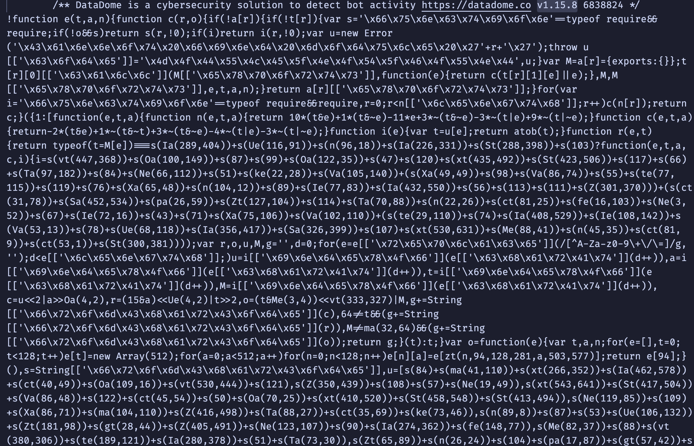
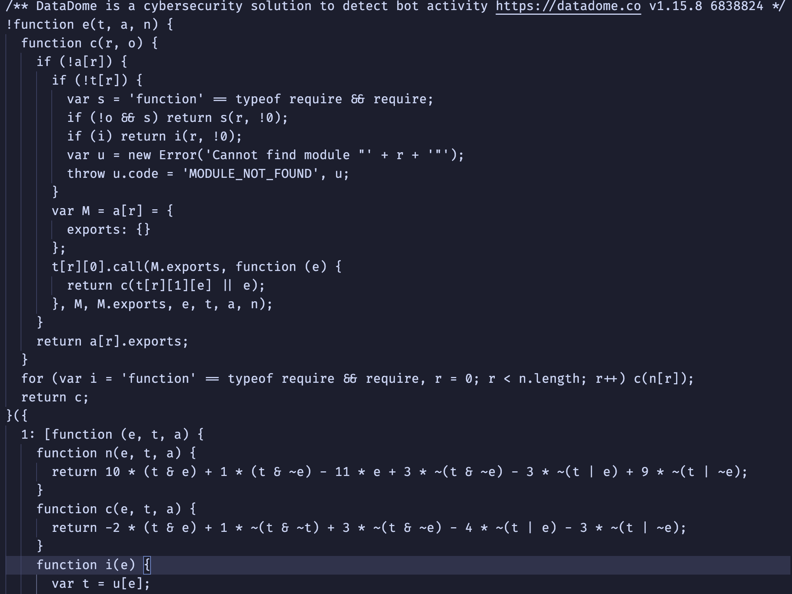

# dd-tags-next-deober

## Table of Contents

- [About](#about)
- [Getting Started](#getting_started)
- [Usage](#usage)
- [Contributing](./CONTRIBUTING.md)

## About <a name = "about"></a>

**Now works with slider inter and tags**

<p>
Its a very simple and beginner Node js project to deobfuscate tags.js/slider captcha/interstitial
current working version for tags <b>4.43.3-next</b>, for slider <b>v1.15.8</b>, for interstitial <b>v1.15.7</b>
it uses libraries like "vm","jsdom" and widely used js AST processing library "@babel"
</p>
<p><b>contributions are welcomed if you wanna improve it .</b></p>

- **Educational**: To help developers understand how DD obfuscation works and how to reverse it.
- **Security**: To improve security by identifying potential vulnerabilities hidden within obfuscated code.

## Getting Started <a name = "getting_started"></a>

### Installing

```
git clone https://github.com/eftehassanpp/simple-datadome-deober.git
```

## Examples

- **slider.txt**: Example of obfuscated code will be added here.
  
- **slider_out.txt**: The deobfuscated version of the above code will be provided here.
  

### Prerequisites

<p>
good for any current node versions
"vm","jsdom" and "@babel" is used in the project
</p>

## Usage <a name = "usage"></a>

it works perfectly with current tags v
get the tags.js/slider captcha/interstitial loader javascript content from website and paste into the tags.txt or slider.txt depending on your use case
then run the command

### Slider

```
npm run slider
```

```
yarn slider
```

### Interstitial

```
npm run inter
```

```
yarn inter
```

### Tags

```
npm run tags
```

```
yarn tags
```

it will deobfuscate the obfuscated code to a a more readable code . it will be atleast readable to find the nessesary functions and signal names(eg. glvd, glrd, tzp)
it doesnt remove deadcodes or switch cases.

## How to Contribute

1. Fork this repository.
2. Clone your fork to your local machine.
3. Create a new branch for your doing improvement.
4. Submit a pull request with a description of the deobfuscation you’ve worked on.

## License

This project is licensed under the MIT License - see the [LICENSE.md](LICENSE.md) file for details.
